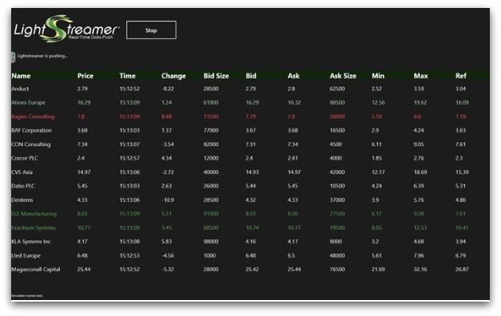

# Lightstreamer - Basic Stock-List Demo - WinRT Client

<!-- START DESCRIPTION lightstreamer-example-stocklist-client-winrt -->

This project contains a demo client showing integration between [Lightstreamer WinRT Client](http://www.lightstreamer.com/docs/client_winrt_api/frames.html) and the WinRT platform.

## Live Demo

 

###[ View live demo](http://apps.microsoft.com/webpdp/en-US/app/lightstreamer-stock-list-demo/8467d915-5499-44b7-8d20-93baaf916682) 

## Details

This is a WinRT (Windows Runtime for Windows 8) version of the [Stock-List Demos](https://github.com/Weswit/Lightstreamer-example-Stocklist-client-javascript). 
This app uses the <b>WinRT Client API for Lightstreamer</b> to handle the communications with Lightstreamer Server. A simple user interface is implemented to display the real-time data received from Lightstreamer Server.

In particular, this readme file details the steps required in order to execute the demo on a Windows 8 installation using Visual Studio Express for Windows 8.

### Dig the Code

* <b>App.xaml.cs</b> is the main application file, it contains application events handling code (application launching, closed, activated, etc), Lightstreamer Client streaming controls (start, stop) and part of the auto-reconnection logic required when connection quality is weak.
* <b>MainPage.xaml.cs</b> is the place where all the application widgets are handled. The application in fact, consists in a simple table containing real-time (simulated) stock quotes, whose cells are kept up-to-date by implementing the ILightstreamerListener interface.
  Several lines in this file are dedicated to the animation code used for highlighting cells in case of real-time updates, you can ignore them altogether if you feel more comfortable.
* <b>LightstreamerClient.cs</b> is a simple wrapper for LSClient public class (see Lightstreamer WinRT Client API) and uses two listeners: <b>StocklistConnectionListener.cs</b> and <b>StocklistHandyTableListener.cs</b>, respectively implementing a Connection Status listener and a Real-Time Data Updates listener.
  
Check out the sources for further explanations. 

<i>NOTE: not all the functionalities of the Lightstreamer WinRT Client Library are exposed by the classes listed above. You can easily expand those functionalities using the WinRT Client API as a reference.   
If in trouble check out the [Lightstreamer forum](http://forums.lightstreamer.com/).</i>

<!-- END DESCRIPTION lightstreamer-example-stocklist-client-winrt -->

## Install

If you want to skip the build process of this demo please note that you can install and run the app from the Windows Store, either click the image or link above from within Windows 8, or go to the store and search for "Lightstreamer". 

## Build 

To directly import the project as is you can use Visual Studio Express for Windows 8. You can download it from the [Microsoft website](http://www.microsoft.com/visualstudio/eng/downloads#d-express-windows-8) (requires Windows 8). 
You may run the demo against your local server or using our online server at http://push.lightstreamer.com:80. The server to which the demo will connect to is configured in the App.xaml.cs file. 

You should complete this project with the Lightstreamer WinRT Client library, to be used for the build process. 
Please, download the latest Lightstreamer distribution and copy the DotNetClient_WinRT.dll and DotNetClient_WinRT.pdb files from the Lightstreamer WinRT Client SDK (that is located under the /DOCS-SDKs/sdk_client_winrt/lib folder) into the "lib" folder of this project.

You're now ready to import the project into Visual Studio, click on File->New Project->Blank App and import all the files located in the demo folder. 
From Visual Studio, right-click on the WinRTStockListDemo project in the Solution Explorer menu and select Debug->Start New Instance. The WinRT app will be installed and launched.

## See Also

## Lightstreamer Adapters Needed by This Demo Client

<!-- START RELATED_ENTRIES -->
* [Lightstreamer - Stock-List Demo - Java Adapter](https://github.com/Weswit/Lightstreamer-example-Stocklist-adapter-java)
* [Lightstreamer - Reusable Metadata Adapters- Java Adapter](https://github.com/Weswit/Lightstreamer-example-ReusableMetadata-adapter-java)

<!-- END RELATED_ENTRIES -->

## Related Projects

* [Lightstreamer - Stock-List Demos - HTML Clients](https://github.com/Weswit/Lightstreamer-example-Stocklist-client-javascript)
* [Lightstreamer - Basic Stock-List Demo - jQuery (jqGrid) Client](https://github.com/Weswit/Lightstreamer-example-StockList-client-jquery)
* [Lightstreamer - Stock-List Demo - Dojo Toolkit Client](https://github.com/Weswit/Lightstreamer-example-StockList-client-dojo)
* [Lightstreamer - Basic Stock-List Demo - Java SE (Swing) Client](https://github.com/Weswit/Lightstreamer-example-StockList-client-java)
* [Lightstreamer - Basic Stock-List Demo - .NET Client](https://github.com/Weswit/Lightstreamer-example-StockList-client-dotnet)
* [Lightstreamer - Stock-List Demos - Flex Clients](https://github.com/Weswit/Lightstreamer-example-StockList-client-flex)
* [Lightstreamer - Basic Stock-List Demo - Silverlight Client](https://github.com/Weswit/Lightstreamer-example-StockList-client-silverlight)

## Lightstreamer Compatibility Notes 

- Compatible with Lightstreamer WinRT Client Library version 1.0 or newer.
- For Lightstreamer Allegro (+ WinRT Client API support), Presto, Vivace.
